# LoRa and LoRaWAN testing bench with GPS tracking

Last changed on June 9, 2020.

## Table of contents

<!--
@HINT:
auto-generate the TOC with the command line tool 'gh-md-toc' (https://github.com/ekalinin/github-markdown-toc) with following syntax:
$ cat README.md | ./tools/github-markdown-toc/gh-md-toc - > toc.md
-->

* [Introduction](#introduction)
  * [Aim of the project](#aim-of-the-project)
  * [Requirements to the testing bench](#requirements-to-the-testing-bench)
* [A brief overview of LoRa topologies](#a-brief-overview-of-lora-topologies)
* [LoRa or LoRaWAN? - The difference is 1 GPIO pin of the ESP](#lora-or-lorawan---the-difference-is-1-gpio-pin-of-the-esp)
* [Node-RED Flows](#node-red-flows)
* [Display GPS tracks on OSM worldmap](#display-gps-tracks-on-osm-worldmap)
* [Storing the transmitted data: SQLite database layout](#storing-the-transmitted-data-sqlite-database-layout)
* [Visual impressions of my experimental breadboard setup](#visual-impressions-of-my-experimental-breadboard-setup)
* [Bill of materials (BOM)](#bill-of-materials-bom)
* [Breadboard layout and schematics (version with ESP8266)](#breadboard-layout-and-schematics-version-with-esp8266)
* [Breadboard layout and schematics (version with ESP32)](#breadboard-layout-and-schematics-version-with-esp32)
* [Troubleshooting](#troubleshooting)
  * [Writing serial output with timestamps to a logfile](#writing-serial-output-with-timestamps-to-a-logfile)
    * [Method 1: Use minicom](#method-1-use-minicom)
    * [Method 2: Use command line tools](#method-2-use-command-line-tools)
  * [I²C: fighting strange pixel errors on OLED display](#ic-fighting-strange-pixel-errors-on-oled-display)
    * [Observation](#observation)
    * [Thesis 1: EMC issues with the LoRa radio module](#thesis-1-emc-issues-with-the-lora-radio-module)
    * [Thesis 2: Power supply of the MCU is to weak](#thesis-2-power-supply-of-the-mcu-is-to-weak)
    * [Thesis 3: I²C signals at SDA and SCL line are disturbed](#thesis-3-ic-signals-at-sda-and-scl-line-are-disturbed)
* [License](#license)

# Introduction

## Aim of the project

The aim of this project is to build a test environment based on ESP8266 or ESP32 for [LoRa](https://en.wikipedia.org/wiki/LoRa) and LoRaWAN as [LPWAN](https://en.wikipedia.org/wiki/LPWAN) long-range radio network.

## Requirements to the testing bench

For this purpose, two identical test modules were each equipped with a LoRa transceiver, a GPS module and an OLED display for displaying the current data.

Both test modules were initially prototypically built on breadboards. Power is supplied via the microUSB port of the ESP8266 NodeMCU (respectively NodeMCU ESP-32S) and optionally connected to the USB port of the development computer. This allows debugging via the serial interface and the serial monitor at the same time.

Alternatively, a LiPo power bank can also be used for both test modules, making them mobile for upcoming range tests.

At the moment, watertight food storage boxes are used as provisional and outdoor-suitable housings.

Firmware updates can be submitted via USB-to-serial interface or by using the *Over-The-Air (OTA)* update functionality to take advantage of maximum mobility :) In my opinion this is an essential feature for IoT applications! For an introduction to this technique start here: [Over-the-air programming](https://en.wikipedia.org/wiki/Over-the-air_programming) or there: [ESP8266 OTA Updates with Arduino IDE | Over the Air](https://randomnerdtutorials.com/esp8266-ota-updates-with-arduino-ide-over-the-air/).

GPS coordinates are transferred via MQTT to a Raspberry-based Node-RED-Server. On this server there is a dedicated flow what cares for
- the displaying on the OpenStreetMap widget (install *'node-red-contrib-web-worldmap'* package) and
- the storage of the GPS coordinates (smoothed by floating average) in a SQLite database (install *'node-red-node-sqlite'* package).

# A brief overview of LoRa topologies

LoRa is usable in an **Point to Point communication** like this:

<!-- @TODO: insert image of LoRa p2p -->
(image will follow soon)

Furthermore, it can be used in an full blown LoRa network on the basis of **LoRaWAN** like this:

<!-- @TODO: insert image of LoRaWAN network -->
(image will follow soon)

# LoRa or LoRaWAN? - The difference is 1 GPIO pin of the ESP

For the application of a [TTN](https://www.thethingsnetwork.org/docs/) based LoRaWAN network 1(!) additional GPIO pin of the ESP mcu to the LoRa transceiver module is required. Unfortunately, this pin of the ESP8266 is not available because all others are already occupied by the other peripherals and communication channels (e. g. *UART* to the gps sensor, *I2C* to the OLED display and *SPI* to the LoRa transceiver module itself).

Because of this dilemma the whole project had to be migrated for the use of ESP32 with its significantly more GPIO pins. It was a hard piece of work since there are many differences in the Arduino API especially in the wifi handling. So there are many `#defines` in the source for choosing the right mcu platform and software modules.

# Node-RED Flows

Here you can see the Node-RED Flow for displaying the GPS coordinates on the OpenStreetMap and for storaging in an SQLite database for 2 ESP nodes:

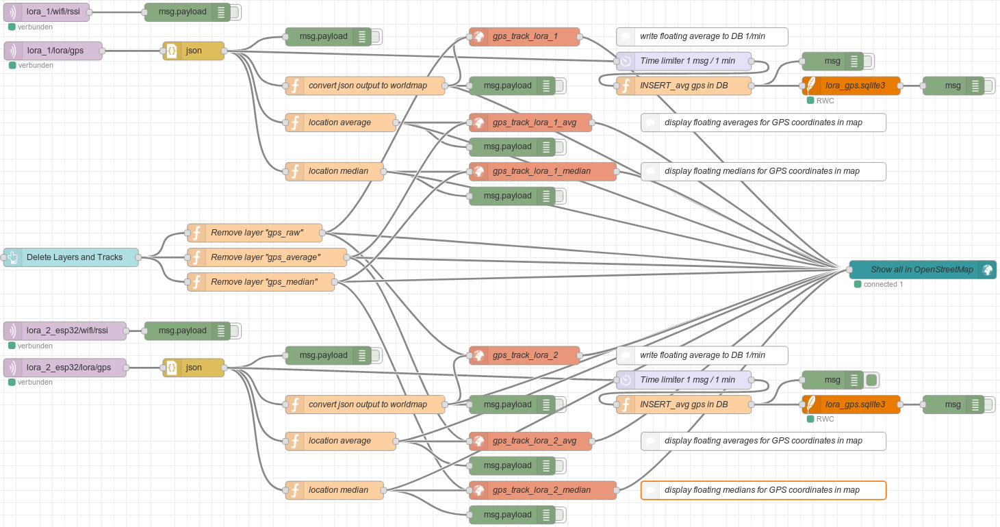

There is my Node-RED Flow ready to import it to your own Node-RED installation [lora_1u2_map.json](./node-red_ttn/lora_1u2_map.json). To use it, you have to additionally install following Node-RED packages:

- `node-red-dashboard`
- `node-red-contrib-web-worldmap`
- `node-red-node-sqlite`

# Display GPS tracks on OSM worldmap

The experimental breadboard setup (including the gps sensor) is located on the outside windowsill of my office with a view to the southeast. This is a screenshot of the OSM worldmap and the gps tracks recorded over some time:

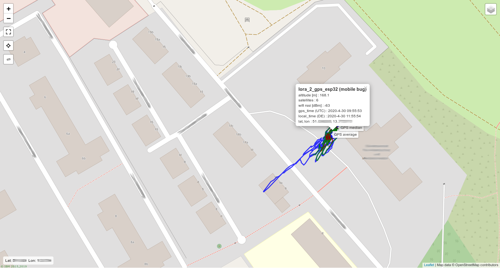

The colors of the gps tracks have the following meaning:

- blue: *raw* positioning data from gps sensor
- red: smoothed data by *running average*
- green: smoothed data by *running median*

# Storing the transmitted data: SQLite database layout

Here is a screenshot of *phpLiteAdmin* to show my SQLite database layout for storing the GPS coordinates:


# Visual impressions of my experimental breadboard setup

Here you can see one of two test modules build on breadboard:


In this picture you can see the other test module on top of the provisional and outdoor-suitable housing (watertight food storage box):

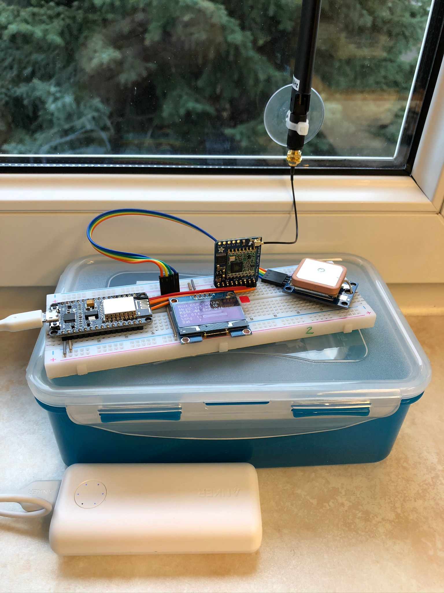

# Bill of materials (BOM)

Following parts I have used in this project (every component you will need twice of course):

- **NodeMCU v2 (ESP8266)** or **NodeMCU ESP-32S**
- OLED I2C display, 128 x 64 Pixel, 1.3 Zoll (SSH1106 chip)
- GPS module u-blox Neo-6M (GY-GPS6MV2 chip)
- LoRa transceiver Adafruit RFM9x LoRa Radio (RFM95W chip, 868 MHz)
- LoRa antenna (868 MHz), 3 dBi omnidirectional
- u.FL/IPEX to SMA connector (so called 'pigtail')
- USB cable with micro USB plug
- breadboard full+ (830 holes)
- wire jumpers
- LiPo battery pack

# Breadboard layout and schematics (version with ESP8266)

With *Fritzing* (https://fritzing.org) I have created following breadboard layout:


The schematics looks like this:


# Breadboard layout and schematics (version with ESP32)

With *Fritzing* (https://fritzing.org) I have created following breadboard layout:

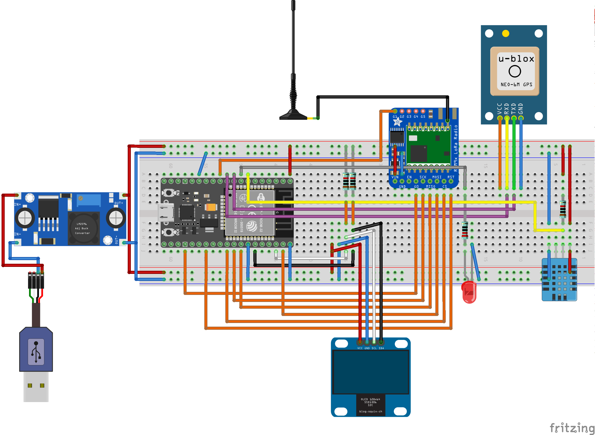

The schematics looks like this:

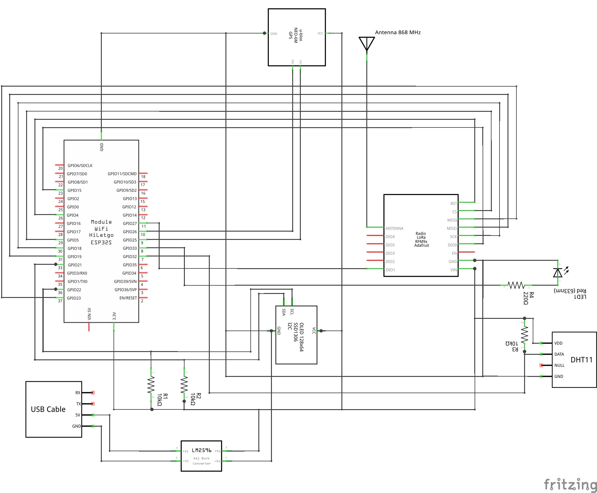

<!--## Software libraries and documentation

Go to the source code: I have supplied it with many comments for explanation.-->

# Troubleshooting

In this section I will describe some typical hardware or software problems that I have struggled with for several days.

(to be continued)

## Writing serial output with timestamps to a logfile

Connect the ESP8266 / ESP32 via a microUSB cable directly to a Linux computer or a Raspberry Pi.

### Method 1: Use `minicom`

Start `minicom` and configure the serial connection via `C-a o`. Especially the path to the serial device (e. g. `/dev/ttyUSB0`), the correct baud rate (115200 baud) and the stop and parity bits (8N1) have to be set.

Activate timestamps via `C-a n`. Do that several times and cycle through the timestamps modes: 'no timestamps', 'simple timestamps' and 'advanced timestamps' (with milliseconds). I use the latter mode, because the serial output with 115200 baud is really fast. See the screenshot below.

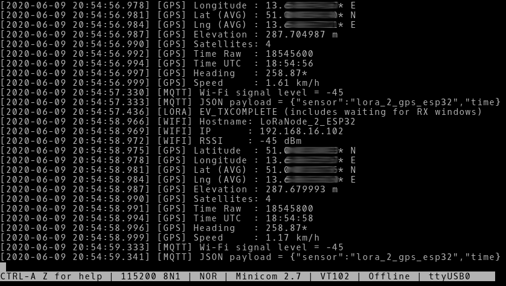

Activate the logging function in `minicom` via `C-a l`. In the dialog box you have to set your desired file name.

### Method 2: Use command line tools

Build a pipeline with several command line tools. For getting timestamps I use the `ts` command - the package `moreutils` has to be installed first (`# apt install moreutils`).

**Prerequisite:** The serial device has to be opened first with the correct settings via another serial tool, like `minicom`.

This is the complete command pipeline:

`$ ts '[%Y-%m-%d %H:%M:%.S]' < /dev/ttyUSB0 | tee -a $(date +%Y-%m-%d)_esp32.log`

Here is the screenshot showing this method:

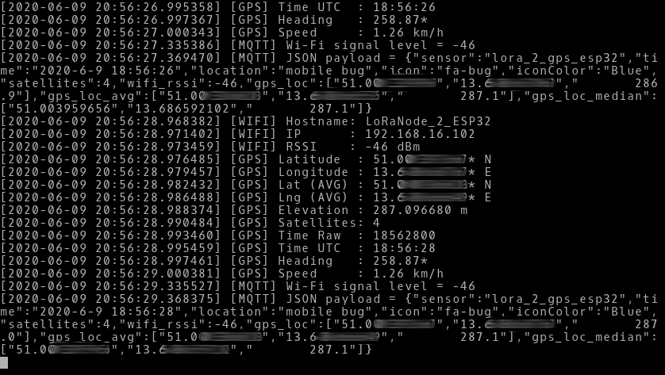

The advantage of piping the `tee` command is, that you can watch the serial output while the logging is done in the background. The option `-a` means, that the given file is appended and not overwritten.

## I²C: fighting strange pixel errors on OLED display

### Observation

After some time there are random pixel errors on the OLED display. It can also happen that the display turns almost completely white and nothing is readable anymore.

| 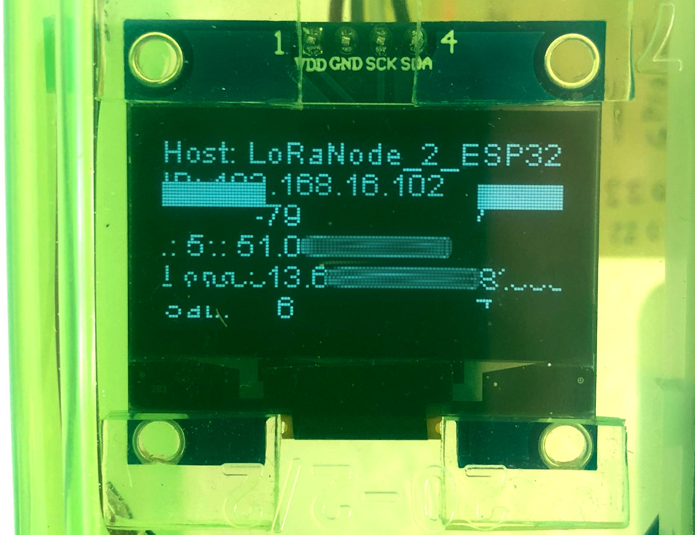 |  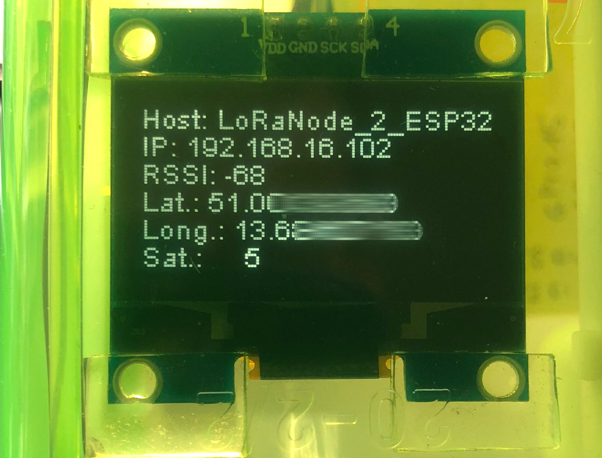 |
| :---- | :---- |
| Strange pixel errors on disturbed display | Undisturbed display |

Hint: I blurred the GPS positions for data protection reasons on both images.

### Thesis 1: EMC issues with the LoRa radio module

**Approach:**  
Shielding with a grounded copper shield (self-adhesive copper foil) and soldered wires to ground.

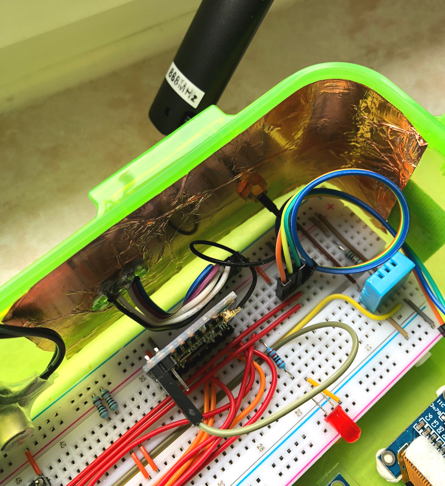

**Results:**  
- LoRa signal strength (RSSI value in dB) decreased significantly
- display errors still appear after a while

### Thesis 2: Power supply of the MCU is to weak

**Approach:**  

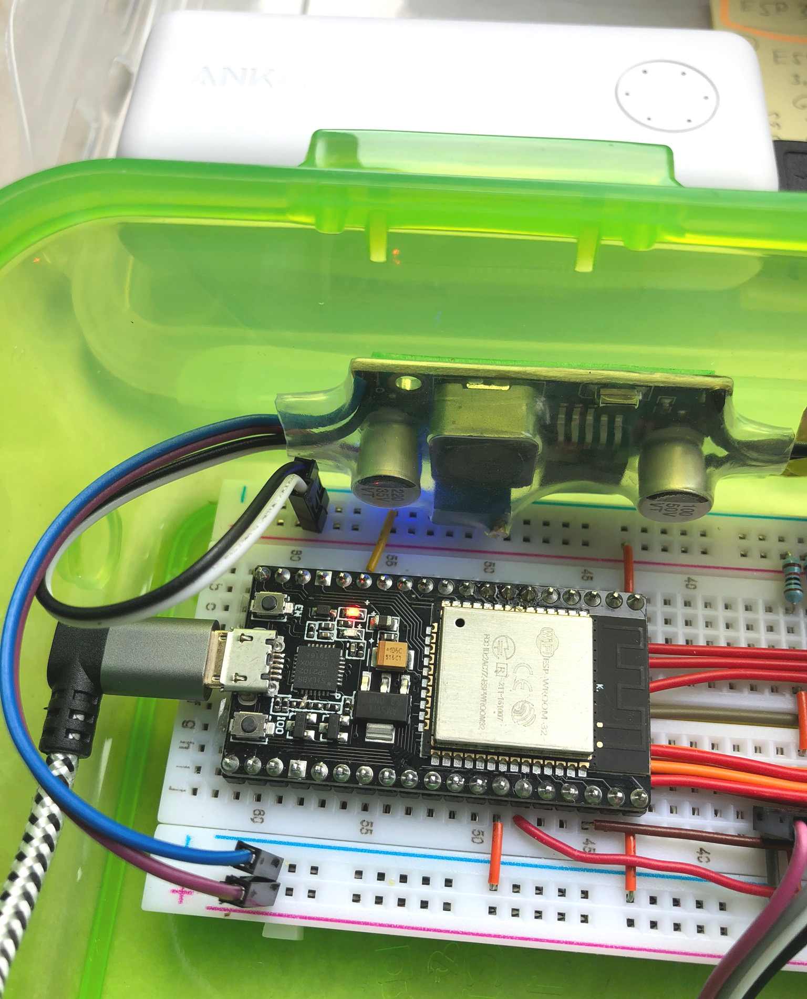

**Results:**  

### Thesis 3: I²C signals at SDA and SCL line are disturbed

Because the OLED display is connected to the I²C bus, I used my storage oscilloscope to examine the signal quality on both the clock (SCL) and the data line (SDA). It turned out that both signals were very disturbed and that the signal edges were not sufficiently good.

**Approach:**  


**Results:**  

Wikipedia:  
- [I²C | Physical layer](https://en.wikipedia.org/wiki/I%C2%B2C#Physical_layer)
- [Pull-up resistor](https://en.wikipedia.org/wiki/Pull-up_resistor)

Forum:  
- [OLED mini-display for ESP32](https://forum.micropython.org/viewtopic.php?t=3764)


# Migrate to MySQL, phpMyAdmin and Grafana

Data  from the nodes are stored in SQLite databases until now. The graphical admin gui is *phpLiteAdmin*.

For advanced exploring the data *Grafana* is a very useful tool. Unfortunately it does not support SQLite databases as data sources. So the challenging task is to install MySQL, PHP7, Grafana and for administration of the MySQL databases *phpMyAdmin*. Then the massive data of the SQLite databases collected in the last half year have to be converted to the MySQL compatible format.

To install the pre-requisites I had done the following on my Raspi with Raspbian GNU/Linux 9.13 (stretch):

Sources:
- [Raspberry PI: Einrichten eines MySQL Datenbankservers (+phpMyAdmin)](https://draeger-it.blog/raspberry-pi-einrichten-eines-mysql-datenbankservers/)
- [Setup a Raspberry Pi MYSQL Database](https://pimylifeup.com/raspberry-pi-mysql/)*
- [How to Install PHPMyAdmin on the Raspberry Pi](https://pimylifeup.com/raspberry-pi-phpmyadmin/)*

```
# apt update
# apt upgrade

# apt install mysql-server
//# apt install libapache2-mod-auth-mysql phpmyadmin
# apt install phpmyadmin

# nano /etc/apache2/apache2.conf
# service apache2 restart
```

phpMyAdmin is now reachable here: [http://192.168.16.184/phpmyadmin/](http://192.168.16.184/phpmyadmin/)

```
# nano /etc/php5/apache2/php.ini
# nano /etc/php/7.0/apache2/php.ini
# cat /etc/php/7.0/apache2/php.ini | grep -i extension=mysql
# mysql -u root -p

# service apache2 restart
# wget -q -O - https://packages.grafana.com/gpg.key | sudo apt-key add -
# echo "deb https://packages.grafana.com/oss/deb stable main" | sudo tee -a /etc/apt/sources.list.d/grafana.list
# apt update
# apt install grafana
# systemctl status grafana-server
# systemctl start grafana-server

```

## Convert SQLite databases to MySQL format

Unfortunately the data formats and SQL syntaxes are **not** compatible between SQLite and MySQL databases! So you have to convert the database dump files from one format to the other. Especially if there are plenty of datasets the use of a tool is strongly recommended. I used the python tool [sqlite3-to-mysql](https://github.com/techouse/sqlite3-to-mysql) here. First you have to install it via `pip install sqlite3-to-mysql`.

The tool will convert the SQLite data and stream it directly to the MySQL database - so it will be easier if you do it directly on the hosting Raspberry Pi (and slower of course). The name of the existing database in MySQL is here `lora_gps`.

```
$ sqlite3mysql -c 500 -f lora_gps.sqlite3 -d lora_gps -u <mysql user> -p '<password of mysql user>'
```

## Install Grafana

The installation process is very straight forward and described here: [Install Grafana](https://grafana.com/tutorials/install-grafana-on-raspberry-pi/#3).

# License

This project is licensed under the terms of "GNU General Public License v3.0". For details see [LICENSE](LICENSE).


<!--  -->
