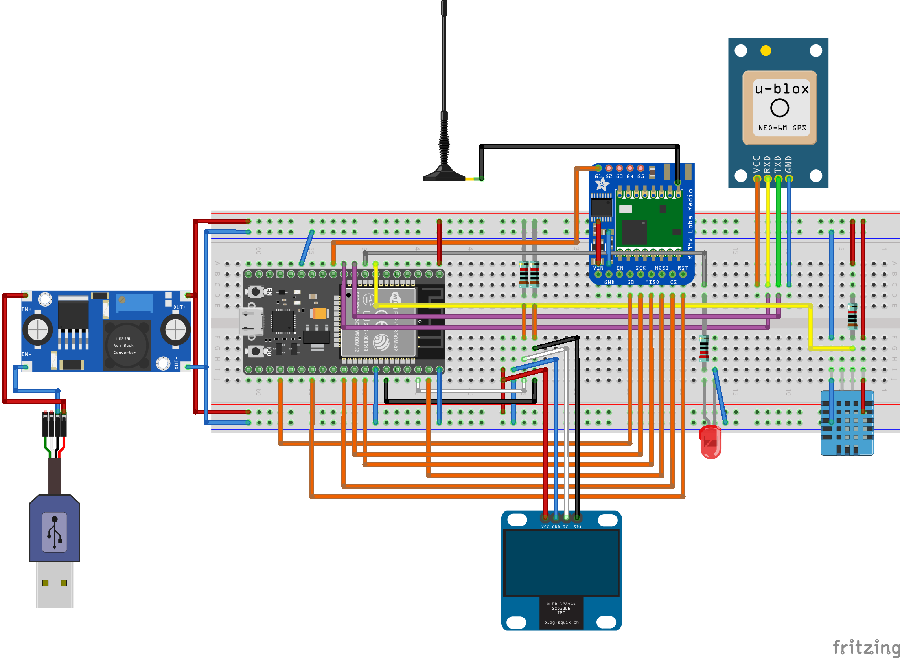

# LoRa testing bench with GPS tracking

## Table of contents

<!--
@HINT:
autogenerate the TOC with the command line tool 'gh-md-toc' (https://github.com/ekalinin/github-markdown-toc) with following syntax:
$ cat README.md | ../tools/github-markdown-toc/gh-md-toc -
-->

* [Introduction](#introduction)
* [LoRa topologies](#lora-topologies)
* [LoRa or LoRaWAN? - The difference is 1 GPIO pin](#lora-or-lorawan----the-difference-is-1-gpio-pin)
* [Node-RED Flow](#node-red-flow)
* [Display GPS tracks on OSM worldmap](#display-gps-tracks-on-osm-worldmap)
* [SQLite database layout](#sqlite-database-layout)
* [Visual impressions of my experimental breadboard setup](#visual-impressions-of-my-experimental-breadboard-setup)
* [Bill of materials (BOM)](#bill-of-materials-bom)
* [Breadboard layout and schematics (version with ESP8266)](#breadboard-layout-and-schematics-version-with-esp8266)
* [Breadboard layout and schematics (version with ESP32)](#breadboard-layout-and-schematics-version-with-esp32)
* [Software libraries and documentation](#software-libraries-and-documentation)
* [License](#license)

## Introduction

The aim of this project is to build a test environment based on ESP8266 or ESP32 for [LoRa](https://en.wikipedia.org/wiki/LoRa) and LoRaWAN as [LPWAN](https://en.wikipedia.org/wiki/LPWAN) long-range radio network.

For this purpose, two identical test modules were each equipped with a LoRa transceiver, a GPS module and an OLED display for displaying the current data.

Both test modules were initially prototypically built on breadboards. Power is supplied via the microUSB port of the ESP8266 NodeMCU (respectively NodeMCU ESP-32S) and optionally connected to the USB port of the development computer. This allows debugging via the serial interface and the serial monitor at the same time.

Alternatively, a LiPo power bank can also be used for both test modules, making them mobile for upcoming range tests.

At the moment, watertight food storage boxes are used as provisional and outdoor-suitable housings.

Firmware updates can be submitted via USB-to-serial interface or by using the *Over-The-Air (OTA)* update functionality to take advantage of maximum mobility :) In my opinion this is an essential feature for IoT applications! For an introduction to this technique start here: [Over-the-air programming](https://en.wikipedia.org/wiki/Over-the-air_programming) or there: [ESP8266 OTA Updates with Arduino IDE | Over the Air](https://randomnerdtutorials.com/esp8266-ota-updates-with-arduino-ide-over-the-air/).

GPS coordinates are transferred via MQTT to a Raspberry-based Node-RED-Server. On this server there is a dedicated flow what cares for
- the displaying on the OpenStreetMap widget (install *'node-red-contrib-web-worldmap'* package) and
- the storage of the GPS coordinates (smoothed by floating average) in a SQLite database (install *'node-red-node-sqlite'* package).

## LoRa topologies

LoRa is usable in an **Point to Point communication** like this:

<!-- @TODO: insert image of LoRa p2p -->
(image will follow soon)

Furthermore, it can be used in an full blown LoRa network on the basis of **LoRaWAN** like this:

<!-- @TODO: insert image of LoRaWAN network -->
(image will follow soon)

## LoRa or LoRaWAN? - The difference is 1 GPIO pin

For the application of a [TTN](https://www.thethingsnetwork.org/docs/) based LoRaWAN network 1(!) additional GPIO pin of the ESP mcu to the LoRa transceiver module is required. Unfortunately, this pin of the ESP8266 is not available because all others are already occupied by the other peripherals and communication channels (e. g. *UART* to the gps sensor, *I2C* to the OLED display and *SPI* to the LoRa transceiver module itself).

Because of this dilemma the whole project had to be migrated for the use of ESP32 with its significantly more GPIO pins. It was a hard piece of work since there are many differences in the Arduino API especially in the wifi handling. So there are many `#defines` in the source for choosing the right mcu platform and software modules.

## Node-RED Flow

Here you can see the Node-RED Flow for displaying the GPS coordinates on the OpenStreetMap and for storaging in an SQLite database for 2 ESP nodes:

There is my Node-RED Flow ready to import it to your own Node-RED installation [lora_1u2_map.json](./node-red/lora_1u2_map.json). To use it, you have to additionally install following Node-RED packages:

- `node-red-dashboard`
- `node-red-contrib-web-worldmap`
- `node-red-node-sqlite`

## Display GPS tracks on OSM worldmap

The experimental breadboard setup (including the gps sensor) is located on the outside windowsill of my office with a view to the southeast. This is a screenshot of the OSM worldmap and the gps tracks recorded over some time:

The colors of the gps tracks have the following meaning:

- blue: *raw* positioning data from gps sensor
- red: smoothed data by *running average*
- green: smoothed data by *running median*

## SQLite database layout

Here is a screenshot of *phpLiteAdmin* to show my SQLite database layout for storing the GPS coordinates:

## Visual impressions of my experimental breadboard setup

Here you can see one of two test modules build on breadboard:

In this picture you can see the other test module on top of the provisional and outdoor-suitable housing (watertight food storage box):

## Bill of materials (BOM)

Following parts I have used in this project (every component you will need twice of course):

- **NodeMCU v2 (ESP8266)** or **NodeMCU ESP-32S**
- OLED I2C display, 128 x 64 Pixel, 1.3 Zoll (SSH1106 chip)
- GPS module u-blox Neo-6M (GY-GPS6MV2 chip)
- LoRa transceiver Adafruit RFM9x LoRa Radio (RFM95W chip, 868 MHz)
- LoRa antenna (868 MHz), 3 dBi omnidirectional
- u.FL/IPEX to SMA connector (so called 'pigtail')
- USB cable with micro USB plug
- breadboard full+ (830 holes)
- wire jumpers
- LiPo battery pack

## Breadboard layout and schematics (version with ESP8266)

With *Fritzing* (https://fritzing.org) I have created following breadboard layout:

The schematics looks like this:

## Breadboard layout and schematics (version with ESP32)

With *Fritzing* (https://fritzing.org) I have created following breadboard layout:

The schematics looks like this:

## Software libraries and documentation

Go to the source code: I have supplied it with many comments for explanation.

## License

This project is licensed under the terms of "GNU General Public License v3.0". For details see [LICENSE](LICENSE).

<!-- ## Todo and known issues

[issue 2019-12-07] Packet message counters flip over sporadically (this may be due to crashes of the mcu). -->

<!--  -->
