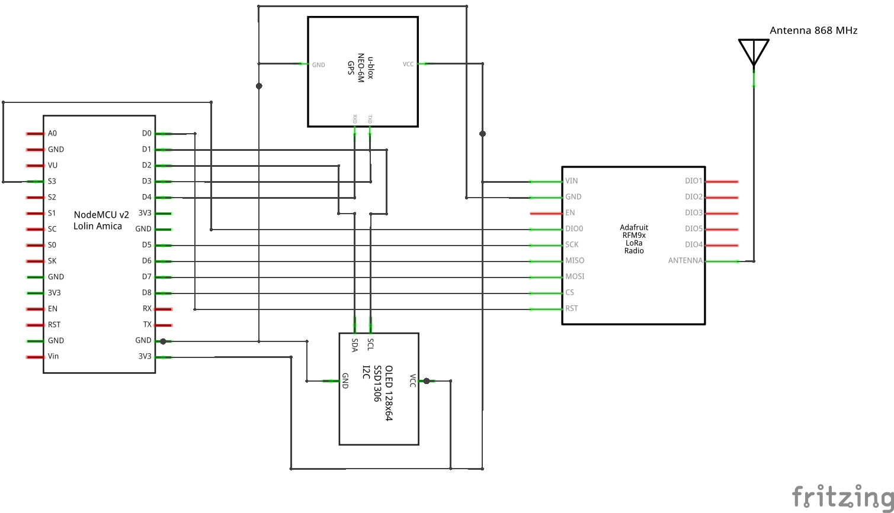

# LoRa testing bench with GPS tracking

<!-- Ziel dieses Projektes ist es, eine Testumgebung auf Basis von ESP8266 für LoRa als LPWAN-Langstreckenfunk aufzubauen. -->
The aim of this project is to build a test environment based on ESP8266 for [LoRa](https://en.wikipedia.org/wiki/LoRa) as [LPWAN](https://en.wikipedia.org/wiki/LPWAN) long-range radio.

<!-- Dazu wurden zwei identische Testmodule mit jeweils einem LoRa-Transceiver, einem GPS-Modul sowie einem OLED-Display zur Aktualdatenanzeige ausgestattet. -->
For this purpose, two identical test modules were each equipped with a LoRa transceiver, a GPS module and an OLED display for displaying the actual data.

<!-- Beide Testmodule wurden zunächst auf Breadboards prototypisch aufgebaut. Die Spannungsversorgung erfolgt über den microUSB-Port des ESP8266 (NodeMCU v2) und wahlweise angeschlossen an den USB-Port des Projektierungsrechners. Damit kann gleichzeitig ein Debugging über die serielle Schnittstelle und den Serial Monitor erfolgen. -->
Both test modules were initially prototypically built on breadboards. Power is supplied via the microUSB port of the ESP8266 (NodeMCU v2) and optionally connected to the USB port of the configuration computer. This allows debugging via the serial interface and the serial monitor at the same time.

<!-- Alternativ kann auch für beide Testmodule eine LiPo-Powerbank verwendet werden, wodurch sie für anstehende Reichweitentests mobil einsetzbar ist. -->
Alternatively, a LiPo power bank can also be used for both test modules, making them mobile for upcoming range tests.

<!-- Als provisorische und outdoor-taugliche Gehäuse dienen im Moment wasserdichte Frischhaltedosen. -->
At the moment, watertight food storage boxes are used as provisional and outdoor-suitable housings.

## Visual impression

Here you can see one of two test modules build on breadboard:

In this picture you can see the other test module on top of the provisional and outdoor-suitable housing (watertight food storage box):

## Parts list

Following parts I have used in this project:

- breadboard half+ (400 holes)
- wire jumpers
- LiPo battery pack
- USB cable with mini USB plug
- breadboard power supply (with Mini-USB-**Input**)
- Wemos D1 Mini pro (ESP8266)
- Neopixel RGB LED ring, diameter 50 mm (with 12 seperate controllable RGB LEDs by WS2812B chip)
- DFPlayer mini MP3 player module
- microSD card (16 GB)
- passive speaker (2 W, 8 Ohm)
- PIR module (motion sensor based on HC-SR501)
- resistor 1 kOhm (for protecting RxD input of DFPlayer)
- capacitor 1000 µF (protecting the Neopixel LED module)

## Breadboard layout and schematics

With *Fritzing* (https://fritzing.org) I have created following breadboard layout:

The schematics looks like this:

## Software libraries and documentation

## Todo and known issues

[issue 2019-12-07] Packet message counters flip over sporadically.

<!--  -->
