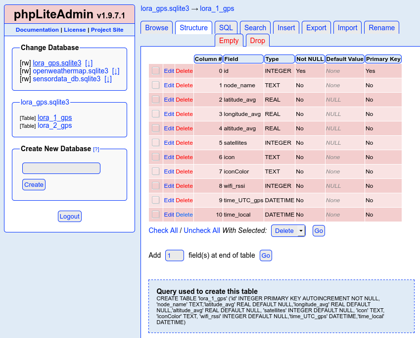

# LoRa testing bench with GPS tracking

The aim of this project is to build a test environment based on ESP8266 for [LoRa](https://en.wikipedia.org/wiki/LoRa) as [LPWAN](https://en.wikipedia.org/wiki/LPWAN) long-range radio.

For this purpose, two identical test modules were each equipped with a LoRa transceiver, a GPS module and an OLED display for displaying the actual data.

Both test modules were initially prototypically built on breadboards. Power is supplied via the microUSB port of the ESP8266 (NodeMCU v2) and optionally connected to the USB port of the configuration computer. This allows debugging via the serial interface and the serial monitor at the same time.

Alternatively, a LiPo power bank can also be used for both test modules, making them mobile for upcoming range tests.

At the moment, watertight food storage boxes are used as provisional and outdoor-suitable housings.

Firmware updates can be submitted via USB-to-serial interface or by using the *Over-The-Air (OTA)* update functionality to take advantage of maximum mobility :) In my opinion this is an essential feature for IoT applications! For an introduction to this technique start here: [Over-the-air programming](https://en.wikipedia.org/wiki/Over-the-air_programming) or there: [ESP8266 OTA Updates with Arduino IDE | Over the Air](https://randomnerdtutorials.com/esp8266-ota-updates-with-arduino-ide-over-the-air/).

GPS coordinates are transferred via MQTT to a Raspberry-based Node-RED-Server. On this server there is a dedicated flow what cares for
- the displaying on the OpenStreetMap widget (install *'node-red-contrib-web-worldmap'* package) and
- the storage of the GPS coordinates (smoothed by floating average) in a SQLite database (install *'node-red-node-sqlite'* package).

## Node-RED Flow

Here you can see the Node-RED Flow for displaying the GPS coordinates on the OpenStreetMap and for storaging in an SQLite database for 2 ESP nodes:

There is my Node-RED Flow ready to import it to your own Node-RED installation (maybe you have to additionally install some node widgets e.g. the *'node-red-contrib-web-worldmap'* package) [lora_1u2_map.json](./node-red/lora_1u2_map.json).

## SQLite database layout

Here is a screenshot of *phpLiteAdmin* to show my SQLite database layout for storing the GPS coordinates:

## Visual impressions of my test setup

Here you can see one of two test modules build on breadboard:

In this picture you can see the other test module on top of the provisional and outdoor-suitable housing (watertight food storage box):

## Bill of materials (BOM)

Following parts I have used in this project (every component you will need twice of course):

- **NodeMCU v2 (ESP8266)**
- OLED I2C display, 128 x 64 Pixel, 1.3 Zoll (SSH1106 chip)
- GPS module u-blox Neo-6M (GY-GPS6MV2 chip)
- LoRa transceiver Adafruit RFM9x LoRa Radio (RFM95W chip, 868 MHz)
- LoRa antenna (868 MHz), 3 dBi omnidirectional, SMA plug
- USB cable with micro USB plug
- breadboard full+ (830 holes)
- wire jumpers
- LiPo battery pack

## Breadboard layout and schematics

With *Fritzing* (https://fritzing.org) I have created following breadboard layout:

The schematics looks like this:

## Software libraries and documentation

Go to the source code: I have supplied it with many comments for explanation.

## License

This project is licensed under the terms of "GNU General Public License v3.0". For details see [LICENSE](LICENSE).

<!-- ## Todo and known issues

[issue 2019-12-07] Packet message counters flip over sporadically (this may be due to crashes of the mcu). -->

<!--  -->
